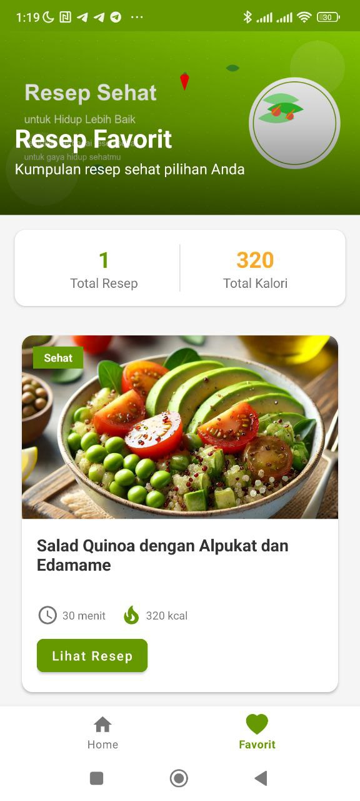

# Uts Pemogramanan Mobile

# 🍲 Resep Sehat

  
  

## 👤 Profil Mahasiswa

| Atribut            | Keterangan                    |
| ------------------ | ----------------------------- |
| **Nama**           | Alvin Alfandy                 |
| **NIM**            | 312310473                     |
| **Kelas**          | TI.23.A.5                     |
| **Mata Kuliah**    | Pemrograman Mobile 1          |
| **Dosen Pengampu** | Donny Maulana S.kom., M.M.S.I |

---

## 🥗 Selamat Datang di Aplikasi **Resep Sehat**!

# Aplikasi Resep Sehat

Selamat datang di project Aplikasi Resep Sehat! Aplikasi ini dirancang untuk memudahkan pengguna dalam mencari dan mengelola resep makanan dan minuman sehat, memberikan akses ke berbagai resep sehat yang mudah diikuti, lengkap dengan fitur kategori dan favorit untuk pengalaman pengguna yang lebih terorganisir dan nyaman.

## Tujuan Aplikasi

1. **Mendukung Gaya Hidup Sehat**
   Memotivasi pengguna untuk mengadopsi pola makan sehat dengan menyediakan resep makanan dan minuman yang bergizi, sederhana, dan praktis.

2. **Mempermudah Pencarian Resep**
   Dengan fitur kategori, pengguna dapat dengan mudah menemukan resep yang sesuai dengan kebutuhan, seperti makanan atau minuman sehat, tanpa perlu mencari secara manual.

3. **Meningkatkan Pengalaman Pengguna**
   Fitur favorit memungkinkan pengguna menyimpan resep yang mereka sukai untuk diakses kembali dengan cepat dan mudah di kemudian hari.

4. **Menginspirasi Pilihan Sehat**
   Memberikan ide baru untuk variasi makanan dan minuman sehat, sehingga pengguna tetap termotivasi untuk menjaga pola makan sehat tanpa merasa bosan.

5. **Mendorong Transformasi Digital**
   Menghadirkan platform yang mendukung penggunaan teknologi digital untuk membantu masyarakat memilih gaya hidup sehat dengan cara yang lebih modern dan efisien.

## Fitur Utama

- **Kategori Resep**: Membagi resep menjadi kategori makanan dan minuman untuk mempermudah pencarian.
- **Resep Favorit**: Menyimpan resep yang disukai pengguna untuk akses lebih cepat.
- **Fitur Pencarian**: Memungkinkan pengguna mencari resep berdasarkan nama bahan atau jenis masakan, sehingga memudahkan menemukan resep yang diinginkan.
- **Konten Resep Sehat**: Terdiri dari 10 resep pilihan, 5 untuk makanan sehat dan 5 untuk minuman sehat.
- **Antarmuka yang Intuitif**: Desain antarmuka yang sederhana dan mudah digunakan, cocok untuk semua kalangan pengguna.

Aplikasi Resep Sehat adalah solusi terbaik bagi Anda yang ingin menjalani gaya hidup sehat tanpa repot. Selamat mencoba dan nikmati perjalanan Anda menuju hidup lebih sehat!

---

## 📝 Storyboard

## 🎨 Mockup

## 💻 UI/UX Preview

---

# Aplikasi Resep Sehat

## Status Proyek: Phase 1 Initial Development

Pada tahap pertama ini, fokus kami adalah membangun fondasi utama Aplikasi Resep Sehat. Kami mengembangkan fitur inti seperti tampilan beranda, halaman detail resep, dan navigasi ke halaman favorit. Desain pada tahap ini masih minimalis, dengan tujuan memastikan stabilitas dan fungsionalitas dasar aplikasi.

## Fitur Utama Aplikasi:

### 1. Beranda (Home)

Fitur ini menjadi halaman awal yang dilihat oleh pengguna saat membuka aplikasi. Di sini, pengguna dapat menemukan:

- Daftar resep makanan dan minuman sehat
- Kategori resep (makanan dan minuman)
- Fitur pencarian resep

Tujuan dari fitur ini adalah untuk memberikan gambaran umum tentang resep-resep yang tersedia dan memudahkan pengguna dalam menemukan resep yang diinginkan.

### 2. Halaman Detail Resep

Fitur ini menampilkan informasi lengkap tentang resep yang dipilih, termasuk:

- Nama resep
- Bahan-bahan yang dibutuhkan
- Langkah-langkah pembuatan
- Informasi nutrisi (jika tersedia)
- Opsi untuk menambahkan ke favorit

Halaman ini dirancang untuk memberikan informasi yang jelas dan mudah diikuti bagi pengguna yang ingin mencoba resep tersebut.

### 3. Navigasi ke Halaman Favorit

Meskipun halaman favorit belum sepenuhnya dikembangkan, navigasi ke halaman ini sudah diimplementasikan. Pengguna dapat mengakses halaman ini melalui navbar, namun fungsionalitasnya masih terbatas.

## Catatan Pengembangan:

- Desain UI masih dalam tahap awal dan akan terus disempurnakan
- Fungsionalitas pencarian dan penyimpanan resep favorit akan dikembangkan lebih lanjut pada fase berikutnya
- Pengoptimalan performa dan perbaikan bug akan dilakukan secara berkelanjutan

Aplikasi Resep Sehat terus berkembang untuk menyediakan pengalaman pengguna yang lebih baik dalam menemukan dan mencoba resep-resep sehat.

## Status Proyek: Phase 2 - Peningkatan Fitur dan Pengalaman Pengguna

Pada tahap kedua ini, kami fokus pada peningkatan fungsionalitas dan pengalaman pengguna Aplikasi Resep Sehat. Kami telah menambahkan fitur-fitur baru dan menyempurnakan yang sudah ada untuk memberikan pengalaman yang lebih baik kepada pengguna.

## Apa yang Baru di Phase 2?

1. Implementasi fitur Favorit yang berfungsi penuh
2. Penambahan Splash Screen saat membuka aplikasi
3. Peningkatan fungsionalitas pencarian
4. Penyempurnaan antarmuka pengguna untuk navigasi yang lebih intuitif

## Launcher Icon

Ikon aplikasi utama yang muncul di layar beranda atau daftar aplikasi pada perangkat pengguna. Launcher Icon dirancang untuk mencerminkan identitas visual Resep Sehat yang modern, sederhana, dan profesional. Dengan desain baru, ikon ini dibuat:

- Menggunakan format PNG dengan resolusi tinggi untuk memastikan tampilannya tajam di semua perangkat.
- Menampilkan logo aplikasi dengan warna hijau yang melambangkan kesehatan dan kebugaran.
- Menggabungkan elemen visual seperti daun atau bentuk hati untuk mewakili konsep makanan sehat dan gaya hidup seimbang.
- Dirancang dengan gaya minimalis namun mudah dikenali, memberikan kesan pertama yang positif tentang aplikasi resep sehat.
- Menggunakan kombinasi warna hijau dan putih untuk menciptakan kontras yang menarik perhatian sekaligus menyampaikan pesan kebersihan dan kesegaran.

Launcher Icon ini bertujuan untuk segera mengkomunikasikan tujuan aplikasi Resep Sehat kepada pengguna, menarik perhatian mereka di antara berbagai aplikasi lain di perangkat mereka.

## Fitur Utama Aplikasi:

### 1. Splash Screen

- Tampilan pembuka yang menarik saat aplikasi diluncurkan
- Menampilkan logo dan nama aplikasi "Resep Sehat"
- Berfungsi untuk memuat data awal aplikasi

### 2. Halaman Favorit

- Tambah Favorite
  

- Halaman Tambah Favorite
  

- Daftar resep yang telah ditandai sebagai favorit oleh pengguna
- Opsi untuk menghapus resep dari daftar favorit
- Akses cepat ke resep-resep yang sering digunakan

### 3. Fitur Pencarian

- Pencarian real-time saat pengguna mengetik
- Hasil pencarian yang lebih akurat dan relevan
- Opsi filter pencarian berdasarkan kategori (makanan/minuman)

## Peningkatan Teknis:

- Optimalisasi performa aplikasi untuk loading yang lebih cepat
- Perbaikan bug dan peningkatan stabilitas
- Peningkatan responsivitas UI untuk berbagai ukuran layar

## Status Proyek: Phase 3 - Modernisasi UI dan Peningkatan Fungsionalitas

Pada tahap ketiga ini, fokus utama adalah pada pembaruan antarmuka pengguna untuk memberikan tampilan yang lebih modern dan informatif, serta meningkatkan fungsionalitas beberapa fitur utama.

### 1. Pembaruan Halaman Utama

- Desain yang lebih modern dengan penambahan banner
- Peningkatan tampilan card konten resep:
  - Penambahan icon waktu untuk menunjukkan durasi persiapan
  - Penambahan informasi kalori untuk setiap resep

### 2. Penyempurnaan Halaman Detail Resep

- Pembaruan border untuk tampilan yang lebih modern dan responsif
- Peningkatan desain tombol "Tambah Resep":
  - Penambahan icon hati (love) untuk visualisasi yang lebih menarik

### 3. Modernisasi Halaman Favorit

- Desain ulang untuk tampilan yang lebih modern
- Penambahan fitur baru:
  - Menampilkan total resep favorit yang tersimpan
  - Menghitung dan menampilkan total kalori dari semua resep favorit

Pembaruan ini bertujuan untuk meningkatkan pengalaman pengguna dengan menyajikan informasi yang lebih lengkap dan mudah diakses, serta memberikan tampilan yang lebih segar dan modern pada aplikasi Resep Sehat.

    

## Penutup

Aplikasi Resep Sehat merupakan solusi inovatif untuk membantu pengguna menjalani gaya hidup sehat melalui pilihan makanan dan minuman yang bergizi. Dengan fitur-fitur yang terus dikembangkan melalui tiga fase, aplikasi ini menawarkan pengalaman pengguna yang semakin baik dan fungsionalitas yang semakin lengkap.

Kami berkomitmen untuk terus meningkatkan Aplikasi Resep Sehat dengan:

- Menambahkan lebih banyak resep sehat dan bervariasi
- Mengoptimalkan performa aplikasi
- Meningkatkan desain UI/UX berdasarkan umpan balik pengguna
- Mengembangkan fitur-fitur baru yang bermanfaat

Terima kasih telah menggunakan Aplikasi Resep Sehat. Kami berharap aplikasi ini dapat membantu Anda dalam perjalanan menuju gaya hidup yang lebih sehat dan seimbang.

Jika Anda memiliki saran atau masukan, jangan ragu untuk menghubungi kami. Selamat menikmati perjalanan kuliner sehat Anda bersama Aplikasi Resep Sehat!

## Teknologi yang Digunakan:

- Frontend: Android (Java)
- Desain: Material Design

## Cara Menggunakan Aplikasi

1. **Pilih Resep**: Telusuri daftar resep di beranda atau gunakan fitur pencarian untuk menemukan resep yang diinginkan.
2. **Lihat Detail Resep**: Klik pada resep untuk melihat informasi lengkap, termasuk bahan-bahan dan langkah-langkah pembuatan.

3. **Tambahkan ke Favorit**: Jika Anda menyukai resep tersebut, gunakan opsi "Tambahkan ke Favorit" untuk menyimpannya di halaman favorit Anda.

4. **Akses Halaman Favorit**: Kunjungi halaman favorit untuk melihat semua resep yang telah Anda simpan dan akses dengan cepat.

5. **Coba Resep**: Ikuti langkah-langkah yang tertera pada halaman detail resep untuk menyiapkan makanan atau minuman sehat yang Anda pilih.

Aplikasi Resep Sehat dirancang untuk memudahkan Anda dalam menemukan dan mencoba berbagai resep sehat dengan cara yang menyenangkan dan terorganisir!

  
© 2025 Alvin Alfandy - Aplikasi Resep Sehat

